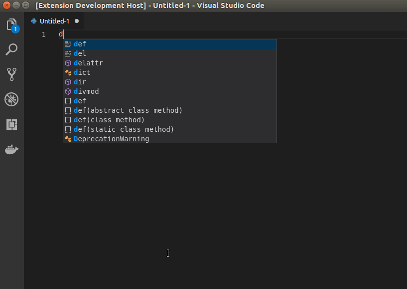

# PyDoc README

This is a simple VSCode extension which helps in adding Docstrings to your python code. Currently docstrings for `Functions` and `Classes` are supported.

## Features

Add elaborated Docstrings to your python code!

Currently Supports docstrings for:

* Functions - with/without arguments and keyword arguments
* Class

## Extension Settings

After you have installed the extension:

* Select the function/class that you want to write the docstring for
* Hit `Ctrl+Shift+P` which brings up the command palette
* Select `Docstring` and hit `Enter`

> Tip: Please refer the below GIF for a demo

## Release Notes

### 0.0.2

Add icon to extension

### 0.0.1

Initial release of PyDoc extension for VS Code

**Enjoy!**
